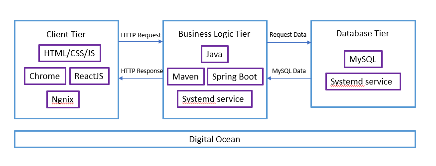

# Booking System Client

The Booking System web application is the final assignment of HACK-IT! At OCBC. It is a full stack application built using React (Frontend) and Spring Boot (Backend) accompanied with a MYSQL database. 

The frontend application is built using React Hooks and ES6 JS as much as possible. For write-up on backend, visit [here](https://github.com/geraldspacelim/booking-system-backend). Since the focus of this asssignment is on the robustness of the entire application, styling of the web application is minimise.

## Architecture 

## Available Scripts

In the project directory, you can run:

### `npm install`

Downloads the required dependencies.

### `npm start`

Runs the app in the development mode.\
Open [http://localhost:3000](http://localhost:3000) to view it in the browser.

## Features 

1. Display all the seats in a theatre in grid view (including their statuses)
2. Allows user to click on an empty seat and the seat number is being relfected  
3. If user clicks on a seat that has already been booked (reflected and not reflected), the web application will prompt an error
4. If a seat is available, the user will be asked for their first name, last name and email in a form 
5. Upon successful submission of the form, the user will be notified of their sucessful reservation via email
6. Disabling multiple form submission  
7. The web application is capable of handling sequential and concurrent scenarios during form submission 

## Possible improvements 

1. Add captcha to prevent bot submissions 
2. Allow only single click on buttons 

## Packages 
1. **axios** - Promise based HTTP client for the browser and node.js
